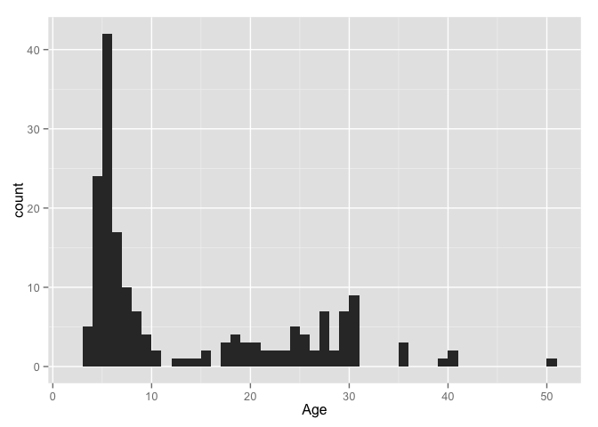

# There Were Children
Suzanne Hartley  
December 5, 2015  


The [Trans-Atlantic Slave Trade Database](http://www.slavevoyages.org/tast/index.faces) has 
information on more than 35,000 slave voyages. An interactive interface allows researchers to create listings, tables, charts, and maps using information from the database. 

Available [data downloads](http://www.slavevoyages.org/tast/database/download.faces) include a subset of the [African Names Database](http://www.slavevoyages.org/tast/resources/slaves.faces) which identifies 67,460 Africans taken from captured slave ships or from African trading sites from 1819 to 1845. 

In this exploratory study:  
* infants and children aged 5 years or less are identified  
* a voyage with a large number of young children is examined in more detail  


  
### Data  

The downloaded file was read into R as a dataframe 

```r
indata <- read.csv("AfricanNamesDatabase.csv")
```

Below is shown the overall structure and content of the data:


```
## 'data.frame':	67460 obs. of  12 variables:
##  $ id      : Factor w/ 67460 levels "1","10","100",..: 1 11095 22200 33310 44379 52423 53534 64622 66119 2 ...
##  $ name    : Factor w/ 48610 levels "","[sic] Manuel",..: 12948 22196 16706 41791 33904 29026 44090 45607 45570 42247 ...
##  $ age     : int  30 30 28 22 16 22 20 30 18 23 ...
##  $ height  : num  62.5 64 65 62.5 59 67.5 62 65.5 61.5 62 ...
##  $ sexage  : Factor w/ 7 levels "","Boy","Female",..: 6 6 6 6 6 6 6 6 6 6 ...
##  $ country : Factor w/ 559 levels "","\\Baronoke",..: 1 1 1 302 302 1 302 302 1 1 ...
##  $ voyageId: int  2314 2315 2315 2315 2315 2315 2315 2315 2315 2315 ...
##  $ shipname: Factor w/ 277 levels "","Adelaide",..: 182 84 84 84 84 84 84 84 84 84 ...
##  $ datearr : int  1819 1819 1819 1819 1819 1819 1819 1819 1819 1819 ...
##  $ majbuypt: Factor w/ 47 levels "","Ambriz","Anomabu",..: 28 45 45 45 45 45 45 45 45 45 ...
##  $ majselpt: Factor w/ 5 levels "","Bahamas, port unspecified",..: 3 3 3 3 3 3 3 3 3 3 ...
##  $ source  : Factor w/ 43 levels "","FO313/56,1",..: 33 33 33 33 33 33 33 33 33 33 ...
```

In this segment, we will be mostly using the _name_, _age_ and _height_ variables. (Height is reported in inches.) For convenience, some of the "Factor" variables are converted to plain string types:


```r
indata$name <- as.character(indata$name)
indata$country <- as.character(indata$country)
indata$shipname <- as.character(indata$shipname)
indata$majbuypt <- as.character(indata$majbuypt)
indata$majselpt <- as.character(indata$majselpt)
```


### Identifying infants

The obvious place to start is with the _age_ variable, defining an infant as age 1 or less and subsetting the data:


```r
infants <- subset(indata, age <= 1)
nrow(infants)
```

```
## [1] 77
```
Only 77 instances in this subset! Out of more than 67,000! And a quick look at the _height_ variable suggests that some of these may not be infants, assuming _height_ has been correctly recorded:


```r
summary(infants$height)
```

```
##    Min. 1st Qu.  Median    Mean 3rd Qu.    Max.    NA's 
##    0.00   24.00   27.00   29.14   31.50   59.00       6
```

```r
table(cut(infants$height, breaks=seq(0,60,5)), useNA="ifany")
```

```
## 
##   (0,5]  (5,10] (10,15] (15,20] (20,25] (25,30] (30,35] (35,40] (40,45] 
##       0       0       2       5      14      30      10       1       1 
## (45,50] (50,55] (55,60]    <NA> 
##       1       5       1       7
```

However, the _name_ variable may be of some help:


```r
infants$name
```

```
##  [1] "Huackio"             "Guissoee"            "Canosah"            
##  [4] "Belinda"             "Askua's Infant"      "Ponger's Infant"    
##  [7] "Asemma's child"      "Janar's child"       "Laque's child"      
## [10] "Betardy's child"     "Adingah's child"     "Raybaund's Infant"  
## [13] "Omborloo"            "Ahjarme's child"     "Ahkenhaybay's child"
## [16] "Mangah's infant"     "Bowsenee's child"    "Pyesor's child"     
## [19] "Daykussa's child"    "Kissee Child"        "Guah Child"         
## [22] "Acocoa Child"        "Lajay Child"         "Bosovee"            
## [25] "Banjukoo's child"    "Isayto's child"      "Asaijo's chil"      
## [28] "Duballay's child"    "Allubah Child"       "Morai Child"        
## [31] "Awooshue Child"      "Bojarkalay's child"  "Mahdeah's child"    
## [34] "Bahboh's Infant"     "Afolahday's Infant"  "Zovoh's Infant"     
## [37] "Ahbetah's Infant"    "Amafanah's Infant"   "Mannah's Infant"    
## [40] "Yahjoh's Infant"     "Olahdaynea's Infant" "Dahmajae's Infant"  
## [43] "Dobay Infant"        "Ogoloo Infant"       "Mattobee Infant"    
## [46] "Arbee Infant"        "Ianokay Infant"      "Amarpay Infant"     
## [49] "Ahjai Infant"        "Bequai Infant"       "Acbackbah's Infant" 
## [52] "Oseeahooh"           "Marrycarm"           "Ahdaybor"           
## [55] "Choo (Infant)"       "Oyóroto"             "Pombó"              
## [58] "Calaba"              "Abam"                "Ladimú"             
## [61] "Ñonsa"               "Bongo"               "Ucuanche"           
## [64] "Banche"              "Lindici"             "Cranche"            
## [67] "Quelenga"            "Quengue"             "Banche"             
## [70] "Ñangue"              "Dominga"             "Badilá"             
## [73] "Golo"                "Maiera"              "Bohon"              
## [76] "Gaimó"               "Amba's child"
```

More than half of the infants are not named, but are identified as the infant or child of a named adult -> perhaps search for "infant" in the _name_ variable.


```r
infants <- grep("[Ii]nfant", indata$name)
length(infants)
```

```
## [1] 158
```

```r
table(indata$age[infants], useNA="ifany")
```

```
## 
##    0    1    2    3    4 <NA> 
##    5   18   64   17    1   53
```
  
There are 158 possible infants in this subset - although the ages for 53 of them are missing. However, in most of these cases, age information appears in the _name_ variable (this is not a tidy data set), for example:


```r
require(dplyr)
infant_names <- indata[infants,] %>% filter(is.na(age)) %>% select(name)
head(infant_names,10)
```

```
##                          name
## 1    Odrayday (Infant 9 mths)
## 2     Ahwarr (Infant 10 mths)
## 3  Arrahcholo (Infant 8 mths)
## 4    Arrayboo (Infant 8 mths)
## 5     Onekay (Infant 10 mths)
## 6     Egga's infant (11 mths)
## 7  Olukaye's infant (13 mths)
## 8    Ajaiay's infant (10mths)
## 9    Mariah's Infant (4 days)
## 10  Akedam's Infant (20 mths)
```

### Expanding the search 

As the "infant" designation seems to include children up through age 4, it might make sense to also include "child":


```r
children <- grep("[Ii]nfant|[Cc]hild", indata$name)
length(children)
```

```
## [1] 270
```

```r
table(indata$age[children], useNA="ifany")
```

```
## 
##    0    1    2    3    4    5 <NA> 
##    5   41   87   28    3    1  105
```

```r
summary(indata$height[children])
```

```
##    Min. 1st Qu.  Median    Mean 3rd Qu.    Max.    NA's 
##       0      25      29      29      33      43      17
```

This search identifies 270 children, aged five years and under, from information in the _name_ variable. The distribution of _height_ suggests that these cases are correctly identified as children. It seems reasonable to now expand the search by _age_ and _height_, selecting persons aged 5 and under with height less than 50 inches:


```r
under6 <- subset(indata, age <=5 & height < 50)
nrow(under6)
```

```
## [1] 590
```

```r
table(cut(under6$height, breaks=seq(0,50,5)), under6$age, useNA="ifany")
```

```
##          
##            0  1  2  3  4  5
##   (0,5]    0  0  0  0  0  0
##   (5,10]   0  0  0  0  0  0
##   (10,15]  0  2  0  0  0  0
##   (15,20]  1  4  3  0  0  0
##   (20,25]  6  8  9  1  0  1
##   (25,30]  0 30 26  3  1  1
##   (30,35]  0 10 50 17  2  1
##   (35,40]  0  1 23 37 47 24
##   (40,45]  0  1  0 15 39 99
##   (45,50]  0  1  0  5 27 94
##   <NA>     1  0  0  0  0  0
```
We have now identified 590 persons as most likely to be young children. Now take a closer look at a voyage which had a large number of children on board:


```r
v <- table(under6$voyageId)
head(rev(sort(v)), 10)
```

```
## 
##  2758  2935 59013 59006 59002  3014  2380  2322  3465  3023 
##    64    32    27    22    22    19    19    19    15    15
```

###Voyage 2758 


```r
V2758 <- subset(indata, voyageId==2758)
nrow(V2758)
```

```
## [1] 178
```

```r
unique(V2758[,c("shipname","datearr", "majbuypt", "majselpt", "country")])
```

```
##      shipname datearr  majbuypt majselpt country
## 2890   Aurora    1822 Gallinhas Freetown        
## 2900   Aurora    1822 Gallinhas Freetown    Crue
```

_Aurora_ was a schooner sailing under the Dutch flag. Voyage 2758 began in the Danish West Indies. The trading of slaves took place mostly at Gallinhas, in what is now Liberia. Freetown, Sierra Leone, is indicated as the landing place. Follow [this link](http://www.slavevoyages.org/voyage/2758/variables) for more details concerning the itinerary fo this voyage - but I will note that:  
  
* under "Outcome of the voyage for owner" is recorded "Original goal thwarted (human agency)"  
* the single named country of origin, Crue, is actually known for only three of the 178 people    
* two people died during the voyage (180 originally embarked.)  

It's astounding how many children were on this voyage:


```r
require(ggplot2)
qplot(V2758$age, binwidth=1, xlab="Age")
```

 

Here's the roll call of everyone with _age_ recorded as 5 or younger (ignoring _height_ in this case) ....


```r
V2758$name[V2758$age <= 5]
```

```
##  [1] "Parnah"    "Wonnee"    "Toorah"    "Feefee"    "Feerah"   
##  [6] "Rogger"    "Tom"       "Bondak"    "Teeppee"   "Teboh"    
## [11] "Gallak"    "Bollak"    "Yallah"    "Boolak"    "Allbohah" 
## [16] "Bomboo"    "Tongaree"  "Miah"      "Saw"       "Tarmoo"   
## [21] "Wiwah"     "Coree"     "Farmah"    "Stambar"   "Macull"   
## [26] "Banaw"     "Peerie"    "Moussa"    "Marsuduma" "Maduoma"  
## [31] "Dollay"    "Joe"       "Kersie"    "Dowro"     "Changway" 
## [36] "Mambar"    "Pannie"    "Kiwool"    "Kenya"     "Yaghe"    
## [41] "Hoonah"    "Hengee"    "Oomah"     "Dumbar"    "Yarmo"    
## [46] "Hoobar"    "Marshday"  "Boree"     "Jumbo"     "Jumbo"    
## [51] "Jongo"     "Mandega"   "Mangdo"    "Badoua"    "Bay"      
## [56] "Magera"    "Marcoo"    "Stallo"    "Wangay"    "Marron"   
## [61] "Coonah"    "Bisee"     "Wongay"    "Oomba"     "Mangou"   
## [66] "Wargella"  "Warrya"    "Carssa"    "Wongay"    "Marruda"  
## [71] "Muigar"
```
... and the 6- to 12-year-olds:


```r
V2758$name[V2758$age >=6 & V2758$age <= 12]
```

```
##  [1] "Barrnah"  "Fromboo"  "Cocao"    "Joe"      "Rogger"   "Seerah"  
##  [7] "Iogboa"   "Fetan"    "Roe"      "John"     "Toofee"   "Bungoo"  
## [13] "Bondosh"  "Tombah"   "Timboa"   "Porley"   "Baymah"   "Tinnah"  
## [19] "Jug"      "Galloy"   "Galloy"   "Boolay"   "Seerah"   "Goobay"  
## [25] "Goomay"   "Serri"    "Gooddaro" "Ovar"     "Parrie"   "Koonar"  
## [31] "Mangroo"  "Awee"     "Bombo"    "Barbong"  "Mayay"    "Bajee"   
## [37] "Konrah"   "Woongar"  "Bio"      "Wongu"    "Mangah"
```

There is no information to connect any of the above children with an adult - or indeed, with any other children. There is no way to identify family groups - assuming there were any in the first place. But... there is perhaps something we can consider.

When children are separated from parents in dire circumstances, the eldest child often takes on the role of "caretaker"" of siblings, even when there is nothing more to do beyond reassuring them that they will be OK if they stick together. There are girls who assume this responsibility readily - and often beyond their own family - looking out for younger children who have no one to care for them. The following table is a breakdown of age by gender:


```r
v <- subset(V2758, age < 16)
table(v$age, as.character(v$sexage))
```

```
##     
##      Female Male
##   3       4    1
##   4      11   13
##   5      17   25
##   6       3   14
##   7       3    7
##   8       1    6
##   9       0    4
##   10      0    2
##   12      0    1
##   13      0    1
##   14      0    1
##   15      0    2
```

In an earlier study, [There Were Teenagers](https://github.com/Suzanne3690/TheyHadNames/blob/master/ThereWereTeenagers.md), I discovered a possible downward bias in reporting ages of teenagers, especially of females - so we shouldn't necessarily conclude that there were no girls aged 9-15 on this voyage. However, I am going to guess that the following girls would have been amongst the oldest of the adolescent females - and may have felt compelled to look after others - even when their own predicament looked hopeless ...


```r
v[(v$age==7 | v$age==8) & v$sexage=="Female",][, c("name","age","height","sexage")]
```

```
##         name age height sexage
## 3048  Konrah   7     53 Female
## 3050 Woongar   7     55 Female
## 3066   Wongu   7     53 Female
## 3067  Mangah   8     54 Female
```
  
 We can only wonder about the lives of Konrah, Woongar, Wongu, and Mangah.
 
 
### Conclusions  
  
* Identifying infants by _age_ alone was inconclusive 
* The _name_ variable provided supplemental information that helped identify 590 children aged 5 or younger  
* Familial relationships were not possible to ascertain for the specific voyage examined in detail - a follow-up study will look at other voyages  
* The data set can definitely use some "tidying" - and these exploratory studies are helping identify variables which need attention


