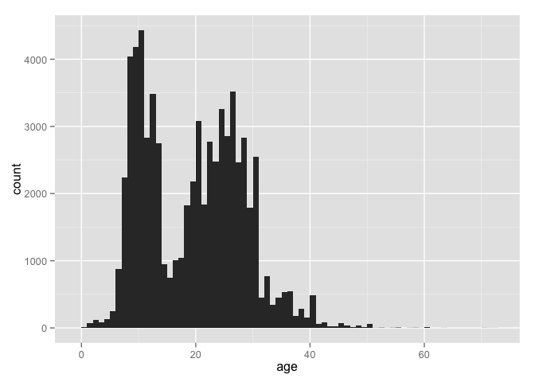
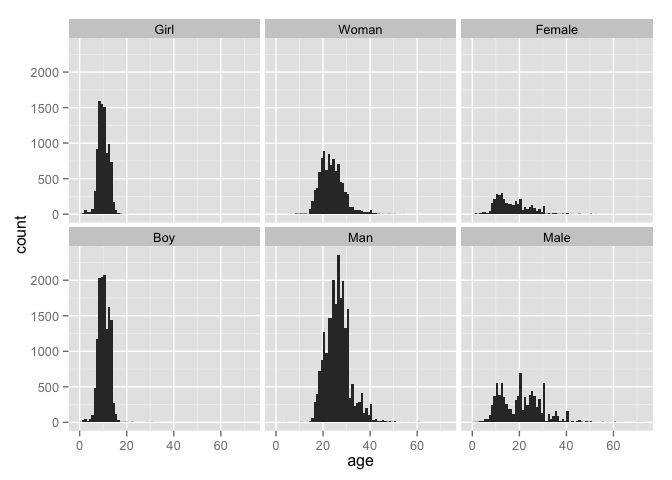
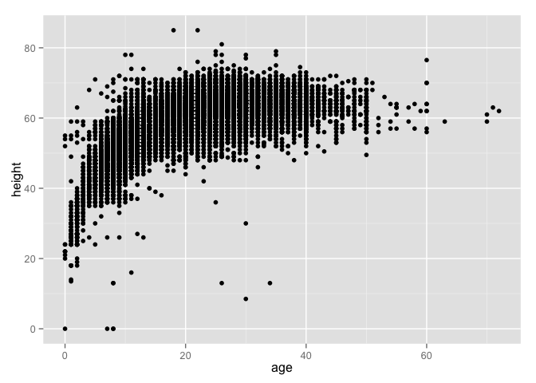
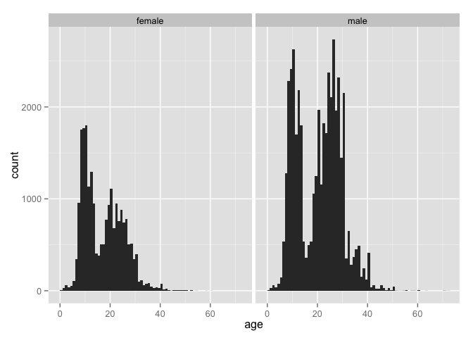

# There Were Teenagers
Suzanne Hartley  
November 1, 2015  


The [Trans-Atlantic Slave Trade Database](http://www.slavevoyages.org/tast/index.faces) has 
information on more than 35,000 slave voyages. An interactive interface allows researchers to create listings, tables, charts, and maps using information from the database. 

Available [data downloads](http://www.slavevoyages.org/tast/database/download.faces) include a subset of the [African Names Database](http://www.slavevoyages.org/tast/resources/slaves.faces) which identifies 67,460 Africans taken from captured slave ships or from African trading sites from 1819 to 1845. Reported here is a finding from an exploratory study of this data set.

The downloaded file was read into R as a dataframe 

```r
indata <- read.csv("AfricanNamesDatabase.csv")
```

Below is shown the overall structure and content of the data:


```
## 'data.frame':	67460 obs. of  12 variables:
##  $ id      : Factor w/ 67460 levels "1","10","100",..: 1 11095 22200 33310 44379 52423 53534 64622 66119 2 ...
##  $ name    : Factor w/ 48610 levels "","[sic] Manuel",..: 12948 22196 16706 41791 33904 29026 44090 45607 45570 42247 ...
##  $ age     : int  30 30 28 22 16 22 20 30 18 23 ...
##  $ height  : num  62.5 64 65 62.5 59 67.5 62 65.5 61.5 62 ...
##  $ sexage  : Factor w/ 7 levels "","Boy","Female",..: 6 6 6 6 6 6 6 6 6 6 ...
##  $ country : Factor w/ 559 levels "","\\Baronoke",..: 1 1 1 302 302 1 302 302 1 1 ...
##  $ voyageId: int  2314 2315 2315 2315 2315 2315 2315 2315 2315 2315 ...
##  $ shipname: Factor w/ 277 levels "","Adelaide",..: 182 84 84 84 84 84 84 84 84 84 ...
##  $ datearr : int  1819 1819 1819 1819 1819 1819 1819 1819 1819 1819 ...
##  $ majbuypt: Factor w/ 47 levels "","Ambriz","Anomabu",..: 28 45 45 45 45 45 45 45 45 45 ...
##  $ majselpt: Factor w/ 5 levels "","Bahamas, port unspecified",..: 3 3 3 3 3 3 3 3 3 3 ...
##  $ source  : Factor w/ 43 levels "","FO313/56,1",..: 33 33 33 33 33 33 33 33 33 33 ...
```

First,  a quick look at where they came from and where they ended up. The variable "majselpt" is the port at which the transported Africans disembarked.


```r
require(dplyr)
indata %>% count(majselpt) %>% arrange(desc(n))
```

```
## Source: local data frame [5 x 2]
## 
##                    majselpt     n
## 1                  Freetown 57072
## 2                    Havana 10058
## 3 Bahamas, port unspecified   183
## 4              Spanish Town   146
## 5                               1
```
Ships embarked from 46 ports ("majbuypt"), carrying persons from 558 named countries of origin ("country"). However, for 55,364 of the 67,460 persons (82 percent), the country of origin is not recorded:


```r
indata %>% count(country) %>% arrange(desc(n))
```

```
## Source: local data frame [559 x 2]
## 
##             country     n
## 1                   55364
## 2        Lucumi Ayó  1235
## 3             Congo  1172
## 4        Eboo, Hebo   756
## 5            Lucumi   595
## 6          Mandinga   553
## 7    Carabali Suamo   491
## 8   Lucumi Ecumachó   470
## 9             Gangá   464
## 10 Carabali Camaron   396
## ..              ...   ...
```

More on places later...


## Age distributions


```r
summary(indata$age)
```

```
##    Min. 1st Qu.  Median    Mean 3rd Qu.    Max.    NA's 
##    0.00   11.00   20.00   19.02   26.00  330.00     136
```
There is clearly some erroneous data to look out for - with a maximum recorded age of 330. Examine a fully tally of ages...


```r
table(indata$age)
```

```
## 
##    0    1    2    3    4    5    6    7    8    9   10   11   12   13   14 
##   11   66  119   82  132  246  881 2235 4041 4185 4433 2835 3480 2748  943 
##   15   16   17   18   19   20   21   22   23   24   25   26   27   28   29 
##  744 1002 1040 1828 2182 3080 1841 2775 2473 3261 2852 3520 2468 2836 1793 
##   30   31   32   33   34   35   36   37   38   39   40   41   42   43   44 
## 2547  454  765  340  447  532  541  184  287  154  489   55   83   28   26 
##   45   46   47   48   49   50   51   52   53   54   55   57   58   59   60 
##   71   34   10   32   12   57    2    4    1    3    6    2    3    1   10 
##   63   70   71   72  110  113  114  225  229  330 
##    1    2    1    1    1    1    1    1    1    2
```
... and also plot a histogram, but perhaps exclude the values greater than 100:


```r
require(ggplot2)
qplot(age, data = subset(indata, age < 100), binwidth = 1)
```

 

The bimodal shape of the histogram is interesting. There would appear to be a shortage of people in the mid-teens... however documentation on the [Trans-Atlantic Slave Trade Database](http://www.slavevoyages.org/tast/index.faces) website cautions that [age data](http://www.slavevoyages.org/tast/database/agecategories.faces) must be used with care. Age sometimes had to be *"assessed by Europeans"*", because *"because many African cultures did not attach importance to knowledge of exact ages."* It is possible that age estimates based on height, sexual maturity and overall appearace could by wildly inaccurate if based on European standards.

 Thee "sexage" variable combines age categories with gender. Only 14 persons are unclassified in this field...
 

```r
count(indata, sexage)
```

```
## Source: local data frame [7 x 2]
## 
##   sexage     n
## 1           14
## 2    Boy 12938
## 3 Female  3650
## 4   Girl  9003
## 5   Male  8974
## 6    Man 23231
## 7  Woman  9650
```

... but examination of age range by each level suggests some ambiguity:


```r
indata %>% filter(age < 100) %>% group_by(sexage) %>% summarise(MinAge=min(age, na.rm=FALSE), MaxAge=max(age, na.rm=FALSE))
```

```
## Source: local data frame [7 x 3]
## 
##   sexage MinAge MaxAge
## 1             1     15
## 2    Boy      0     40
## 3 Female      0     60
## 4   Girl      0     23
## 5   Male      0     72
## 6    Man      2     60
## 7  Woman      6     54
```

Plot age histograms for all levels of the "sexage" variable. The factors are first reordered so that plots will be organized by gender.


```r
indata$sexage <- factor(indata$sexage, levels = c("Girl", "Woman", "Female", "Boy", "Man", "Male", ""))
qplot(age, data = subset(indata, age < 100 & sexage != ""), binwidth = 1) + facet_wrap(~sexage)
```

 

For the most part, age distributions broken out by the sexage variable appear reasonable. However, localized peaks at ages 10, 20, 30 and 40 - especially in the "Man" and "Male" categories suggest much guesswork in the recording of ages.

Height is sometimes used to estimate ages of younger people, so a plot of "height"" vs "age" may be worth checking:


```r
qplot(age, height, data=subset(indata, age < 100 ))
```

 

There are obvious outliers (most of which can probably be attributed to recording errors) - but even though the spread of "height" for a given "age" is large, almost all the points plot within a well-defined envelope. So erroneous estimates of age from height are unlikely to stand out.

Finally, recode sexage as a binary (female/male) factor and examine the age distributions by "gender":


```r
indata$gender <- as.character(indata$sexage)
indata$gender[indata$gender %in%  c("Girl", "Woman", "Female")] <- "female"
indata$gender[indata$gender %in% c("Boy", "Man", "Male")] <- "male"
indata$gender[indata$gender == ""] <- NA
qplot(age, data = subset(indata, age < 100 & !is.na(gender)), binwidth = 1) + facet_wrap(~gender)
```

 

The mid-teen gap is very evident for both genders. Both distributions are bi-modal - and the most likely explanation is under-guessing and over-guessing ages of teenagers. However, the female distribution is very assymetric, suggesting that if the mid-teen gap is an artifact of age-guessing, there was a bias in favor of under-guessing the ages of teenage females. It is very probable that white, European males had difficulty assessing the ages of young African women. But is it possible that female teenagers might have been sometimes presented by family members as children in the hope of protecting them?

### Conclusions
* The age distribution shows a gap in the mid-teen years - and this is most probably an artifact of the data 
* However, there does appear to be a bias in favor of under-guessing, as opposed to over-guessing, the age of teenage females - and this might be worth investigating.

